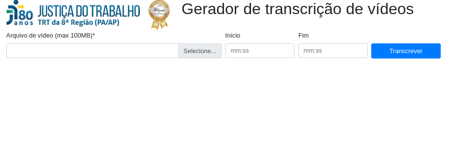

# TrVideos

Trata-se de uma aplicação simples que toma como entrada um arquivo de vídeo (e
opcionalmente um tempo inicial e final) e devolve como saída uma string com
texto correspondente ao que identificou-se que foi falado no vídeo no período
informado.


# tl;dr

```
$ cd trvideos
$ python3 -v venv venv && . venv/bin/activate
$ pip3 install -qq moviepy pydub Flask SpeechRecognition
$ chmod +x transcribe.py
$ ./transcribe.py 

```


# Conceitos

A transcrição de vídeos em si reside sobre a API Google **Speech-to-Text**.
Mais detalhes sobre seu funcionamento e sua utilização em diversas linguagens
de programação podem ser encontrados na sua documentação oficial em
https://cloud.google.com/speech-to-text.

Para esta aplicação, identificou-se que a comunidade Python possui um cliente
com um nível um pouco maior de abstração que faz uso da API Speech-to-Text
chamado **SpeechRecognition**, disponibilizado normalmente [via
PIP](https://pypi.org/project/SpeechRecognition/).


# Arquitetura

Esta aplicação foi desenvolvida inicialmente como um script Python de linha de
comando, como se pode ver no arquivo `transcribe.py`.  Trata-se de um script
simples desenvolvido via programação estruturada e que também cujos métodos
podem ser utilizados como módulo por importação normalmente.

# Requisitos

A aplicação backend em si utiliza os seguintes módulos Python listados
abaixo:

<dl>
<dt>SpeechRecognition</dt>
<dd>https://pypi.org/project/SpeechRecognition/</dd>
<dd>Biblioteca da comunidade Python que abstrai a funcionalidade de
conversão de áudio em texto de vários serviços online.  Utilizado aqui como
camada de abstração para o cliente da API Speech-to-Text do Google.</dd>

<dt>moviepy</dt>
<dd>https://pypi.org/project/moviepy/</dd>
<dd>Biblioteca Python para tarefas de edição de vídeo. Utilizada
essencialmente para fazer corte de trecho do arquivo de vídeo, se
especificado.</dd>

<dt>pydub</dt>
<dd>https://pypi.org/project/pydub/</dd>
<dd>Biblioteca para manipulação de arquivos de áudio.  Útil aqui para
mixagem de canais, tratamento de ruído e identificação de trechos de
silêncio.</dd>
</dt>

Estes são os módulos necessários para a execução da aplicação em backend,
o que é suficiente para executar a aplicação como script Python na linha de
comando.  No entanto, para encapsulá-la e disponibilizar sua chamada via web em formato de API REST é utilizado também o microframework **Flask**.

<dl>
<dt>Flask</dt>
<dd>https://pypi.org/project/Flask/</dd>
<dd>Um microframework simples com servidor embutido desenvolvido para
possibilitar a execução de chamadas a métodos em módulos Python a partir de um
servidor web WSGI via chamadas REST, entre outras funcionalidade úteis como
sanitização e etc.</dd>
</dl>


# Funcionamento do script

Chamado na linha de comando, o script recebe um arquivo de vídeo (normalmente
em formatos .mp4, .ogg ou .webm) e executa alguns passos para trancrevê-lo:

0. Se além do arquivo de vídeo forem informados parâmetros de tempo inicial e
final, o script corta um trecho do vídeo de entrada entre os tempos dados e
passa a utilizá-lo como vídeo de entrada;
1. No arquivo de vídeo de entrada, extrai-se o áudio correspondente;
2. Analisa-se e trata-se o arquivo de áudio, identificando trechos de silêncio
e, a partir deles, quebrando-se a entrada em vários arquivos de áudio com
duração geralmente menor que dois minutos;
3. Para cada arquivo de trecho de áudio, procede-se a transcrição propriamente
dita com chamadas à API Speech-to-Text do cliente Google;
4. Concatena-se os resultados das transcrições dos trechos correspondentes e
retorna-se 

## Observações quanto ao funcionamento do script

* Diversos parâmetros para etapas de funcionamento (notadamente duração e
nível de silêncio, por exemplo) foram identificados a partir de execuções
exaustivas em valores razoáveis por meio de tentativa e erro;

* Os tratamentos feitos no áudio e no vídeo foram necessários para se atender a
requisitos de entrada para a API Speech-to-Text do Google;

* A qualidade do código pode ser aprimorada mas seria adequado a geração de
testes unitários para melhor segurança na refatoração;

# Interface web

Para facilitar a utilização da funcionalidade implementada no script backend
`transcribe.py` uma vez que sua utilização via linha de comando talvez não
seja prática ao público em geral, decidiu-se expor sua funcionalidade como
uma API [REST](https://pt.wikipedia.org/wiki/REST)

No momento a interface web desta aplicação está disponilizada em ambiente de
homologação no endereço https://trvideos.trt8.jus.br



**Modo de usar**

Apenas acesse a [URL](https://trvideos.trt8.jus.br).  Utilize o primeiro campo
para selecionar um arquivo de vídeo e em seguida prima o botão **Transcrever**.
Após aguardar alguns instantes enquanto se dá o processamento da API, as falas
identificadas no vídeo serão transcritas numa caixa de texto que surgirá
abaixo.

Opcionalmente você pode informar também tempo de inícios de fim, e assim, o
texto a ser exibido corresponderá apenas período especificado ao invés de todo
o vídeo.


# Limitações, bugs conhecidos e implementações futuras

* Arquivos muito grandes (teoricamente acima de 100MB mas talvez menos)
resultam em grande demora no processamento e geram expiração de tempo da
requisição no navegador web (ainda que no backend ele sempre devolva a
resposta).

* As entradas de tempo estão limitadas a 59 minutos e 59 segundos.  Mas segundo
secretários, audiências podem eventualmente ser extendidas para além de uma
hora.

* O backend no momento executa todas as etapas de processamento apenas para
entradas de formato de vídeo.  No entanto, pode ser potencialmente útil também
permitir a entrada de formato de áudio, geralmente bem menores, uma vez que o
Zoom tem a possibilidade de gerá-los também.

* Como, no fim das contas, são transcritods diversos trechos de arquivos de
áudio cujos resultados são armazenados em lista e contatenados, esta etapa
provavelmente poderia ser feita em paralelo com o recurso de threads do Python
no sentido de agilizar o processo.

* Também no intuito de minimizar a utilização de recursos, pode ser útil
fazer testes com a biblioteca
[videoconverter.js](https://bgrins.github.io/videoconverter.js/) de forma a
permitir algum processamento como corte de vídeo já no cliente e aliviar a
carga de trabalho do backend.

* O recurso de identificação do interlocutor
([diarization](https://cloud.google.com/speech-to-text/docs/samples/speech-transcribe-diarization-gcs-beta))
tecnicamente permitiria tentar atribuir rótulos a cada palavra de forma a, por
exemplo, permitir diferenciar interlocutores.  No entanto este é um recurso
experimental da API Speech-to-Texto do Google que resultaria numa estrutura de
dados de saída mais complexa, exigindo codificação de mais etapas de
pós-processamento para exibição correta.  

* Nesta primeira versão não se utilizou o modo de processamento longo da API que
exigiria chamada de métodos remotos com padrão específico do Google via GPRC
(potencialmente gerando lock-in) ao invés de chamadas simples e padronizadas
via REST.  Daí a necessidade de se quebrar o arquivo de áudio em trechos
menores.
